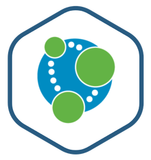

<!-- PROJECT LOGO -->
<br />
<p align="center">
  <a href="https://github.com/chintan196/Neo4jSampleApplication">
    
  </a>

  <h3 align="center">Neo4j Sample Application</h3>

  <p align="center">
    Sample application to demonstrate Neo4j with Spring Boot Angular Application. 
  </p>
</p>

<!-- TABLE OF CONTENTS -->
<details open="open">
  <summary>Contents</summary>
  <ol>
    <li>
      <a href="#about-the-project">About Project</a>
    </li>
    <li>
      <a href="#prerequisites">Prerequisites</a>
    </li>
    <li>
		<a href="#running-the-application">Running the application</a>
	</li>
	<li>
      <a href="#contact">Contact</a>
    </li>
  </ol>
</details>

<!-- ABOUT THE PROJECT -->
## About The Project

* This repository contains a simple Spring Boot API project and and a basic Angular UI to demonstrate communication with Neo4j graph database.

<!-- Prerequisites -->
### Prerequisites

You need to have below prerequisites available to compile and build API and UI applications on a local developer machine.

* Neo4j Database Instance- Locally hosted Neo4j database instance or a [Neo4j Sandbox](https://sandbox.neo4j.com/) instance.
* [Java-11](https://www.oracle.com/in/java/technologies/javase-jdk11-downloads.html)
* [Node](https://nodejs.org/en/download/)
* [NPM](https://www.npmjs.com/package/download)
* Optional [Angular-CLI-7](https://www.npmjs.com/package/@angular/cli/v/7.0.7)
* In case of a Non Linux operating system, you need to have Docker installed to your system. This is required for Test Execution. This step can be skipped by skipTests variable while packaging.

<!-- RUNNING THE APPLICATION -->
## Running the application
* Go to the [application.properties](https://github.com/chintan196/Neo4jSampleApplication/blob/master/src/main/resources/application.properties) file and replace the property variable values with the Neo4j instance information.
* Build and package the Spring Boot application - Execute below command on shell or command prompt on base directory level.

  ```sh
  mvn clean package
  ```
  If you want to skip Test Cases:  
  
  ```sh
  mvn clean package -DskipTests
  ```
  
  This command will generate a target directory inside base directory. A packaged JAR file employees-0.0.1-SNAPSHOT.jar is generated on successful execution.

  Navigate to the target directory to run the application.

* Run the Spring Boot API from packaged JAR file
  ```sh
  java -jar employees-0.0.1-SNAPSHOT.jar
  ```

* Build and Run the Angular UI application

  Navigate to the [AngularUI](https://github.com/chintan196/Neo4jSampleApplication/tree/master/angularui) directory.

  If you are running the Spring Boot API on a location other than localhost:8080, please change the api base address in the [employee.service.ts](https://github.com/chintan196/Neo4jSampleApplication/blob/master/angularui/src/app/employee.service.ts#L10) file under the Angular application.

  Execute below commands in their order to download node_modules, compile and run and build application.

  ```sh
  npm install
  ```
  
    ```sh
  ng serve --open
  ```
  
    ```sh
  ng build --prod
  ```
   
<!-- CONTACT -->
## Contact

Chintan Desai - [chintandesai7](https://www.linkedin.com/in/chintandesai7/)

Project Link: [https://github.com/chintan196/Neo4jSampleApplication](https://github.com/chintan196/Neo4jSampleApplication)
